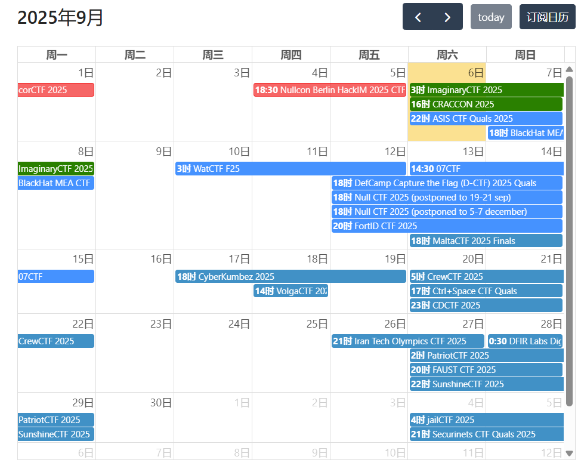
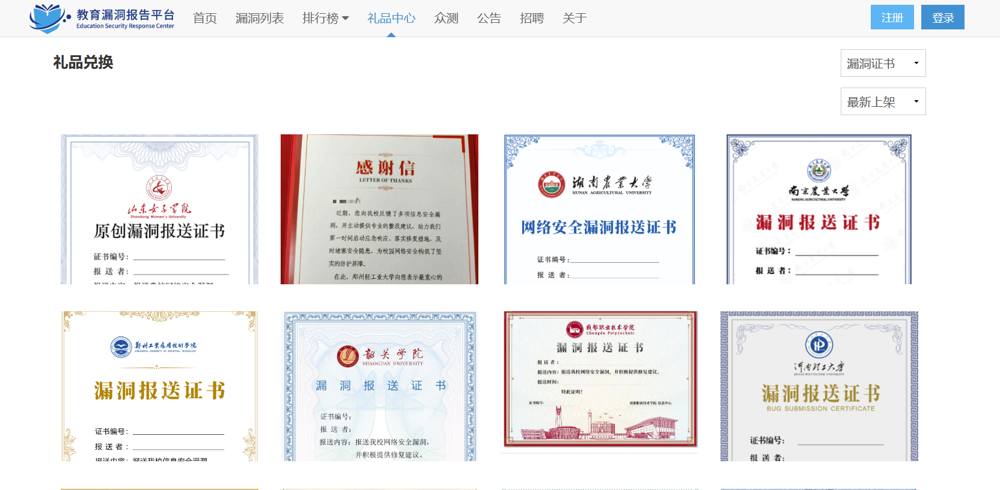

# 网络安全学习经验分享

大家好，我是网络安全专业大四的一名学生，受老师邀请写下这篇网络安全学习经验分享。网络安全虽然也属于计算机类学科，但是却和计算机科学、软件工程那些学科学习的内容有很大区别，因此不少大学都将网络安全独立为一个网络安全学院。所以学习网络安全不能按计科、软工的学习规划去学习，因此有必要提前知道网络安全如何规划和学习。

笔者并非网络安全技术大牛，没有去过网络安全企业实习，也没有参加过网络安全实践（如每年都会进行的护网行动），下面的分享只是个人的经验和见解，建议大家多和其他技术较强且有相关实习经验的学长交流，形成对这个行业正确的见解。

___

## 学习课程建议

首先我有一个见解，就是任何行业的发展都会从建设期走向平稳期，如果一个行业处于建设期，即各种问题还未解决，重要需求需要合理的解决方案，那么它就急需各种人才去建设，那它就会非常重视技术，只要你技术够强，企业不会歧视你的学历。我认为网安前些年就处于“建设期”，非常重视技术，招聘接受大专生，只要你技术够硬就行。但是这些年网安行业逐渐走向平稳期，也就是大多数时候只需要你去做一些重复性的工作，各种问题都陆续有了成熟的解决方案，这时就逐渐开始以学历等因素筛选人。

幸运的是我们一本的学历暂时还算是够用的，对于这个技术指向型的专业，即使是顶级985，老师也无法实打实地教出企业需要你掌握的那些技术，多数大学的专业课程几乎都只是带你入个门，因此都是靠自学。下面推荐几个网课：

1、**小迪安全：**【【小迪安全】全栈网络安全 | 渗透测试 | 高级红蓝对抗 V2024最新版 (完)】 https://www.bilibili.com/video/BV123yAYMEwb/?share_source=copy_web&vd_source=323501daa890812d429bcee3099a669c

2、**暗月安全：**【【暗月渗透】红队攻防工程师 | 渗透测试 | 网络安全（完结版）】 https://www.bilibili.com/video/BV1NQ4y1n7rM/?share_source=copy_web&vd_source=323501daa890812d429bcee3099a669c

3、卖盗版课的：https://fcmit.cc/ （可以去看看他的课表）

如果你有钱的话建议去买正版课，一个是对正版的支持，另外就是正版课都是最新的思路和技术，盗版课几乎都是2024年的课或者更早了。

推荐小迪和暗月这两门课是因为他们讲的很全也很细，直接把网络安全的Web方向几乎从头讲到尾了，这两个课程挑一家看就行了。我自己学习的时候看的是小迪安全，他讲的非常细，非常全，而且安全圈很多人都是听小迪的课学习，就像很多大学生学高数都是看宋浩一样。这个课一共400小时，连学加练的话可能一年多都不够用，所以比较适合大一大二的去学习，学完之后肯定就已经非常强了。

我比较建议大家在大二上结束之前把小迪安全学完，能坚持学完就挺厉害了。虽然我们学校也会讲web安全，但是学校讲什么和我们学什么之间其实没什么关系，不要等学校开课的时候再学，学校要完成的是它的教学任务，而我们有自己的学习任务。另外就是上课时长不等于学习时长，我们应该关注的是自己学习，对于想找网安工作的人来说，要关注的是自己的学习网安的时长以及持续性。

另外需要注意的是：听课学习期间一定要记笔记，使用typora在本地记笔记也好，买记笔记软件也好，一定要记笔记，因为复习要用。

___

## 学习路线建议

其实你看小迪安全的课表就能大概知道路线是什么了：

首先是**计算机类知识的基础**，比如：HTML、CSS、Javascript基础、linux语法操作基础、计算机网络基础、数据库基础、PHP语言基础、Java语言基础。这些都要简单了解一下，简单了解即可，不要浪费时间，或者干脆直接跟着小迪或者暗月的课学习。

然后是**网络安全基础**：Web架构、APP架构、常用技术、加密解密、信息搜集等

然后是**语言基础**：PHP语言、JAVA语言、Javascript语言

然后是**Web安全**：SQL注入漏洞、文件上传漏洞、CSRF漏洞、SSRF漏洞、RCE漏洞等，懂得漏洞原理及防护措施，能实战挖到漏洞。（如何进行实战？去了解一下企业SRC挖掘，EDUSRC挖掘等）然后是**更深一步的Web安全**：反序列化、业务逻辑漏洞、Java安全（java安全是重难点）

然后是**内网渗透**：自己开几台Linux和Win的靶机学习内网横向和内网信息搜集的手法，域渗透先不要学碰不到的

然后是**代码审计**：先学PHP的简单上手，看和复现比如ThinkPHP和相关CMS的漏洞代码产生原理，以及如何修复，用相同的思路去学Java的代码审计，注意先要学语言基础，不要马上上手审计不然学不会的

然后是**免杀**：混淆、致盲、强关、魔改、内核

然后是**域渗透**：搭建域靶场，了解黄金白银钻石票据，配合之前的内网渗透学习内容进行拓展

___

这么多东西怎么学呢？光是念一遍名字都3分钟了，真学起来3年也不够！这里给大家分享几个学习方法：

1、就是要快，用最短的时间学完最多的东西。慢不等于扎实，多次重复+做练习才等于扎实。很多东西第一次听不懂，过一段时间后由于知识积累得更多了，自然就懂了

2、针对实战培养感觉，有些东西实战中用得少就少学少练，但切忌只学不练，就像你高中只听课不做题是学不会的

3、不会的问题不纠结，问题先解决90%

4、注意劳逸结合，学累了可以玩玩手机休息一下，感觉好了再学习。但不建议三天打鱼两天晒网

5、关注一些网安公众号、加入一些网安微信群，多交流多见识

___

## 竞赛建议

### 网安专业竞赛

网安专业基本只有一种竞赛，那就是CTF类竞赛

**只要是CTF类竞赛我都建议参加**，在此挑几个看看：

- 全国大学生信息安全竞赛（CISCN）
- “长城杯”信息安全铁人三项赛
- 强网杯
- 网鼎杯
- 西湖论剑
- 全国大学生信息安全与对抗技术竞赛ISCC

这些都属于是大赛了，要是能在决赛中拿奖，找工作、考研、保研都是很大的加分项

当然，不止是这些大赛，**只要是CTF、AWD类赛事我都推荐参加**，CTF类赛事小比赛特别多，每周都有，在[https://ctfhub.com](https://ctfhub.com) 中可以看到9月有那么多小比赛：

小比赛的奖项可能认可度不高，但是大多数人4年也拿不到一个。**推荐大家先学习网安课程知识，有一定知识和技术之后多打CTF类比赛**。

平时学完知识，比如学完了文件上传漏洞原理，可以去各种CTF平台搜索关于文件上传的题目，然后去解题，巩固对知识点的理解。这就好像你高中上完课要刷练习册一样，学这个专业也是一样的道理。可以把CTF平台当做你的练习场。

CTF解题平台：

BUUCTF：https://buuoj.cn/

CTFSHOW：https://ctf.show/

攻防世界：https://adworld.xctf.org.cn/

BugKu CTF：https://ctf.bugku.com/

nssctf：https://www.nssctf.cn/index

我们学校也有一个ctf平台

关于一些其他网络安全赛事的介绍，可以看这里：https://blog.csdn.net/UBdhxnn/article/details/151259121?sharetype=blogdetail&sharerId=151259121&sharerefer=PC&sharesource=UBdhxnn&spm=1011.2480.3001.8118

### 其他竞赛

我还推荐蓝桥杯等算法竞赛（例如ICPC、ACM等，这种高水平竞赛我不知道咱们学校能不能参加，但是蓝桥杯是可以参加的），其实不是推荐竞赛本身，而是告诉大家要学一学算法，刷算法题。

很多人认为网安专业不搞开发，不用像计科专业的学生一样学算法，网安的确不怎么用算法，但是你找工作的时候如果找的是互联网企业，找的是计算机相关的工作，笔试是要考算法的。还有就是你保研考研面试的时候，很多学校可能有计算机学院、网安学院、人工智能学院、软件学院等，他们研究的东西可能都差不多，你如果只选择网安学院的话那选择就会少很多，你如果想去一些其他的专业（例如计算机科学专业），很可能会有机试考算法。

另外推荐的就是全国大学生数学建模竞赛、美国大学生数学建模竞赛。这两个比赛含金量还是比较高的，大多数人保研加分靠的就是美国大学生数学建模竞赛，也有人靠的是全国大学生数学建模竞赛。其他的比赛能保研加分的概率极小。

___

上面是我推荐的比赛，即CTF类、算法类、两个数模比赛。其他的就不怎么建议了，毕竟时间有限。

___

## 关于漏洞挖掘

SRC 即安全应急响应中心（Security Response Center），是各大企业官方设立的平台，专门接收外部安全人员提交的漏洞并给予现金奖励等回报。挖 SRC 是指安全研究人员通过对软件、小程序和网站等进行安全测试，发现并提交漏洞的过程。

SRC分为企业SRC和edusrc（挖教育行业网站的漏洞，例如各大高校的网站系统的漏洞），因为网络安全的学习非常注重实践，所以学完基础的漏洞之后可以买一些挖src的培训课看看，然后先去挖一挖各高校网站系统的漏洞（因为edusrc相比于企业src要简单很多），很多高校对漏洞报送者是有证书的

有一定水平之后可以去挖企业src，提交漏洞并通过审核之后会有现金奖励，一个漏洞根据危害等级奖励几百到几万元不等。

有些同学在大学期间靠挖src是能挣到挺多钱的，我身边有些同学靠自己的技术挖漏洞，能把自己的生活费学费等都挣出来。国内也有一些很强的大学生，长期霸榜腾讯src榜首，每年靠挖漏洞挣几十万，再凭借挖漏洞经验开培训班，一年合起来能挣上百万，当然这些都是传奇人物了，都是很小的时候就开始学网安了。对于我们来说，挖掘src经历能丰富实战经验还能挣钱，是个不错的选择。

但是，**由于你没有提前拿到对方的授权就开始测试，任何有意或者无意造成的破坏都是犯法的，所以一定要掌握好一个度，而且一定要对技术有明确的了解，不知道会造成什么后果的事就不要做。**

除了edusrc的证书，如果某个企业的注册资本超过5000万，且如果你在他公司资产下发现的漏洞符合一定危险条件，是可以提交到CNVD平台申请CNVD证书的。网址：https://www.cnvd.org.cn/

另外如果技术很强可以挖掘CVE漏洞，即使最后没有结果，有实打实的CVE挖掘经历写到简历里也是很加分的。

相关网站：

漏洞盒子：https://www.vulbox.com/

SRC导航：http://www.newsrc.cn/

补天：https://www.butian.net/Reward/plan/2

教育漏洞报送平台：https://src.sjtu.edu.cn/

___

## 关于英语

四六级一定要过，并且分数尽量高。至少四级一定要过，最好大一就把它过了，四六级考试本身没什么技术含量，努力一下都能过。

四六级真的很重要，是一个硬性要求

___

## 关于考证

建议在大学期间考一些认证，如CISP-PTE、深信服认证等。要想找网安的好工作，漏洞、渗透、SRC、证书 缺一不可。

## 其他

说了这么多，对课程和知识的学习是放在第一位的，没有专业知识的支撑，无法比赛也无法实习也无法写项目。所以建议大家多把时间放在学习网安上，大一的晚自习也不至于一直学四级吧？可能也没那么多课程作业要写，少打会游戏少刷会视频，尽快学习尽快入门，入门之后才能快速进步。水课如果不听的话可以打开网安课程开始学。我们学院的保研数量分配就是按一个班一个名额来算，一个专业如果是两个班，那就是保专业前2，很多人明知到最后也保不了研，就没必要卷绩点了。考试考个六七十，剩余的时间和精力拿来学技术或者考公才对吧。

在大学里，很多人平时随便上上课，下课了回宿舍玩手机、打游戏或者出去玩，到了大三才觉得有点晚了，开始临时决定实在不行随便找一个工作，实在不行考个研，实在不行考个公，结果也大多不尽人意；少数人凭着习惯性的努力，大一保持了一个好绩点，大二大三尝试走保研这条路，最后或许成功或许失败，都不一定是自己内心想走的那条路，只是因为从小习惯了好好学习；只有极少数人从一开始比较懵懂，后来在实践中逐渐了解了自己适合哪一条路，并为止付出努力，最后拿到自己比较满意的结果。所有人都希望自己是那极少数人，所以提前了解提前规划是比较重要的，毕竟大学就3年多的时间。但不管你想怎么度过大学，在做各种决定的时候一定要先听一听自己内心的声音，不要一直去分析利弊、趋利避害，不是保研了就有多好，不是考上了就有多好，找到一个好工作也不一定有多好，不要随大流去做决定，多想想自己到底愿不愿意。不要看别人怎么努力自己就怎么努力，不要因焦虑而做一些选择。

现在实习对于找工作越来越重要了，其实在大三下的暑假期间秋招就已经陆续开始了，如果你想在此之前有一段实习经历（现在很多人都是两三段实习经历），那就最晚是在大三上的寒假，实习之前至少两个月要开始投简历吧，这样的话也就是说截止大三上的前两个月，你对技术栈的学习、简历的形成、面试题的背诵都要初步完成了，所以能踏实从容学习的时间也就两年多一点吧，平时上课又占掉了大多数时间，所以学习时间还是挺紧迫的，大多数人最后对网安就是几乎没有深入学过。另外很多网安专业的大学生、大专生暑假都会去参加国家级护网行动，这是网安界每年非常重要的一个活动，就是会有一些红队成员发起攻击，一线企业招收一些蓝队成员进行防护，这个经历对网安专业非常重要，建议大家提前了解此活动，很多大学生/大专生大一暑假就去参加了，我们就算因为小学期的课程问题去参加不了国家级护网行动，也可以打听打听省级护网行动。这个活动这几年工资下降了，但还是比实习工资高的。而且去应聘一个蓝队初级并不难。应聘的话需要投简历，一般是向护网中介投简历，这些护网中介一般就是那些网安培训机构，如果你经常看网安相关的课程或内容，应该能进入一些微信群，可以到里面问一下如何参加护网以及护网最新消息

很多人看到这么多东西会觉得焦虑和痛苦，这一切只是因为你没有去做，只是在听和想，只要你一点一点逐步去做你会发现机会越来越多、选择越来越多、焦虑越来越少、迷茫越来越少。学习本身不痛苦，自己想得多做得少，一边觉得自己该学习，一边又懒得学习，然后焦虑才痛苦。我个人其实并没有学完那些网络安全课程，只是学了一点而已，也没有拿过什么CTF比赛大奖，以上只是我对网络安全学习的见解，希望大家抓住大一大二的时间，学好网络安全技术或者找到自己想走的路。

___

## 参考资料

《上海交通大学学生生存手册》：https://survivesjtu.gitbook.io/survivesjtumanual/li-zhi-pian/huan-ying-lai-dao-shang-hai-jiao-tong-da-xue

《安徽大学信息安全专业本科生攻略》：https://github.com/LaPhilosophie/AHU-CyberSecurity

《Web安全学习笔记》：https://websec.readthedocs.io/zh/latest/basic/index.html

《“曾哥”对网络安全的思考》：https://blog.zgsec.cn/archives/27.html

___

